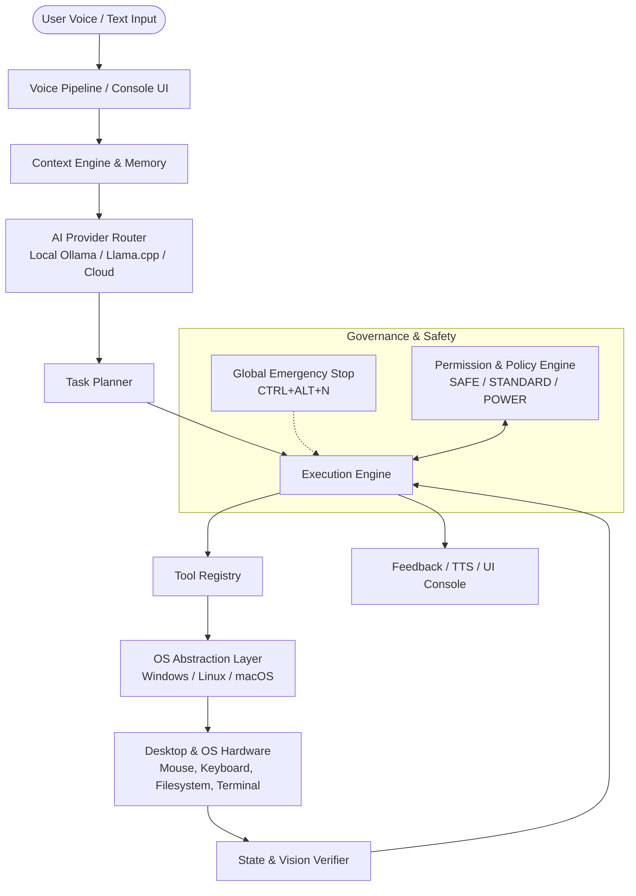
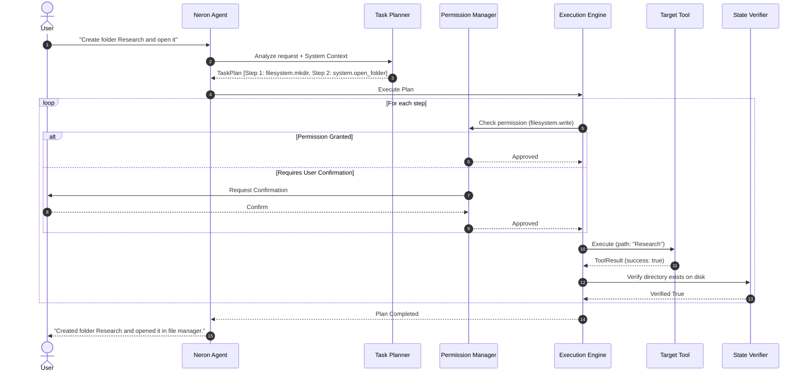

# 🏛️ NERON Architecture Specification

## 1. System Overview

**Neron** is an extensible, local-first computer operating layer and automation agent. It bridges human intent (expressed through natural language or voice commands) with deterministic desktop and system operations, maintaining transparency, strict security controls, and high reliability.

The system is engineered as a decoupled, modular event-driven architecture where no single provider, hardware configuration, or operating system is hardcoded.

---

## 2. Module Boundaries & Responsibilities

### 2.1 Core Subsystem (`neron/core/`)
- **`agent/`**: Top-level orchestrator coordinating perception, context resolution, planning, and tool dispatch.
- **`planner/`**: Decomposes natural language queries into structured `TaskPlan` objects comprising executable `PlanStep`s.
- **`executor/`**: Manages execution state transitions:
  `PENDING` → `PLANNING` → `WAITING_FOR_PERMISSION` → `EXECUTING` → `VERIFYING` → `COMPLETED` / `FAILED` / `CANCELLED`.
  Enforces timeout, retry, rollback, and verification hooks.
- **`events/`**: Asynchronous pub/sub event bus decoupling UI, agent state, hardware signals, and tools.
- **`context/`**: Aggregates conversation history, active window titles, current working directory, active application, and system resource telemetry.
- **`memory/`**: Multi-tiered memory architecture:
  - *Short-Term*: Active turn and context window.
  - *Working Memory*: Active task/session variables.
  - *Long-Term / Semantic*: Persistent user preferences and indexed facts stored in inspectable SQLite.
  - *Procedural Memory*: Saved automation workflows and recipe sequences.

### 2.2 Security & Permissions (`neron/security/`)
- **`PermissionManager`**: Validates each tool invocation against active security policies before execution.
- **Capabilities Matrix**:
  - `filesystem.read`, `filesystem.write`, `filesystem.delete`
  - `terminal.execute`
  - `computer.mouse`, `computer.keyboard`, `computer.screen`
  - `application.control`
  - `system.admin`, `system.inspect`
  - `network.access`
  - `self.modify`, `plugin.install`
- **Security Modes**:
  - `SAFE`: Strictly read-only; prompts user for any write, modification, or process launch.
  - `STANDARD`: Normal operational workflow; prompts for deletion, script execution, or system changes.
  - `POWER_USER`: Broad automation allowed; prompts solely for root/administrative actions.
  - `CUSTOM`: Granular per-permission rules defined in user configuration.
- **`EmergencyStop`**: Real-time interrupt handler listening on a global hotkey (`CTRL+ALT+N`) and software abort events that instantly cancels running plans and revokes thread execution.

### 2.3 OS Abstraction Layer (`neron/os/`)
Isolates all platform-specific code behind standard abstract interfaces:
- **`OSController` (Abstract Base Class)**:
  - `get_platform_name()`
  - `open_application(app_name, args)`
  - `close_application(app_name)`
  - `list_running_processes()`
  - `get_active_window()`
  - `list_open_windows()`
  - `execute_terminal_command(cmd, timeout)`
  - `get_system_telemetry()` (CPU, RAM, Disk, Battery)
  - `get_volume()`, `set_volume(level)`
  - `open_path_in_file_manager(path)`
- Implementations:
  - `WindowsController` (`neron/os/windows/`)
  - `LinuxController` (`neron/os/linux/`)
  - `MacOSController` (`neron/os/macos/`)

The core agent, tools, and planners **never import or invoke platform-specific APIs directly**.

### 2.4 Tool Subsystem (`neron/tools/`)
- **`BaseTool`**: Standardized abstract interface requiring:
  - `name`: Unique identifier (e.g. `filesystem.search`)
  - `description`: LLM-consumable function summary
  - `parameters_schema`: JSON Schema dict describing arguments
  - `required_permissions`: List of required permission strings
  - `execute(args)`: Callable returning structured `ToolResult`
  - `verify(args, result)`: Optional validation hook
- **`ToolRegistry`**: Central registration authority allowing dynamic registration, unregistration, tool discovery, filtering, and execution auditing.

### 2.5 AI & Model Abstraction (`neron/ai/`)
- **`LLMProvider`**: Interface defining `generate_text()`, `chat()`, `stream_chat()`, and structured function/tool calling.
  - `OllamaProvider`: Local inference via local Ollama daemon (`http://localhost:11434`).
  - `LlamaCppProvider`: Direct local Python bindings via llama-cpp-python.
  - `OpenAICompatibleProvider`: Generic local (vLLM, LM Studio) or cloud endpoints.
- **`VisionProvider`**: Interface for multi-modal screenshot reasoning and element localization.
- **`EmbeddingProvider`**: Local sentence transformers or Ollama embeddings for memory retrieval.
- **`AIRouter`**: Dynamic routing engine selecting between local models and online APIs depending on availability, offline state, and user policy.

### 2.6 Computer Control & Vision (`neron/computer/`)
- **`MouseController`**: Position querying, absolute/relative movement, clicking, dragging, scrolling.
- **`KeyboardController`**: Typing text, hotkey combinations, key down/up events.
- **`ScreenCapture`**: High-resolution frame capture with multi-monitor support and region cropping.
- **`WindowManager`**: Title detection, focus switching, minimizing, resizing.

### 2.7 Voice Pipeline (`neron/voice/`)
- Audio Input → Voice Activity Detection (VAD) → Wake Word Detection ("Hey Neron") → Speech to Text (local Whisper) → Agent Processing → Text to Speech (Piper / local TTS) → Audio Output.
- Designed with lazy initialization: audio hardware is only activated when voice mode is explicitly enabled.

### 2.8 Plugin System (`neron/plugins/`)
- Decoupled extension packages living under `plugins/<plugin-id>/`.
- Plugin manifest (`plugin.json` / `plugin.yaml`) declaring metadata, permissions, tools, and entrypoints.
- Dynamic isolation and lifecycle management (`initialize()`, `start()`, `stop()`).

### 2.9 Self-Diagnostics (`neron/diagnostics/`)
- **`HealthManager`**: Comprehensive environment auditor checking:
  - Python runtime & package dependencies
  - Model provider endpoints (Ollama, local weights)
  - Microphone and audio device availability
  - System permission and privilege status
  - Storage space and writable data directories
  - Plugin integrity

### 2.10 Controlled Self-Improvement (`neron/dev_agent/`)
- Operates under the **Neron Development Loop**:
  `Understand` → `Plan` → `Modify in Scratchpad` → `Run Tests` → `Diagnose Failures` → `Package Patch` → `Require User Approval` → `Deploy`.
- Modifies isolated development workspaces rather than in-place production code without user authorization.

---

## 3. Data Flow & Execution Lifecycle

---

## 4. Verification & Self-Healing Contract

Neron implements a two-phase contract for every state-altering tool:
1. **Execution**: The tool executes its native operation.
2. **Verification Hook**: A verification predicate checks the underlying operating system state (e.g. process list query, filesystem stat check, window title match).
3. **Recovery**: If verification fails:
   - Check alternative strategies (e.g. path fallback, secondary executable name).
   - Log diagnostic failure details.
   - Halt execution and explain exact failure point to user rather than pretending success.

---

## 5. Offline vs. Online Degradation Strategy

| Capability | Offline Mode (Local Only) | Online Mode (Enhanced) |
| :--- | :--- | :--- |
| **LLM Reasoning** | Local Ollama / llama.cpp models | Cloud LLM (Claude, GPT, Gemini) or Local |
| **Speech-to-Text** | Local Whisper / faster-whisper | Cloud STT or Local |
| **Text-to-Speech** | Local Piper TTS / Windows SAPI | Cloud TTS or Local |
| **Web Research** | Local cached docs & files | Live web search & browser automation |
| **Computer Control** | Full local access | Full local access |
