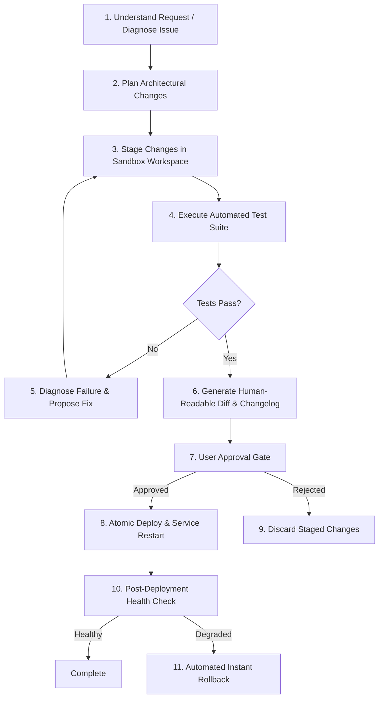

# 🧬 NERON DeveloperAgent & Self-Improvement Specification

## 1. Overview

A defining capability of **Neron** is its ability to inspect, diagnose, and extend its own software over time. Rather than relying on fragile, unconstrained self-modification, Neron implements a structured, sandboxed development subsystem called the **DeveloperAgent**.

The DeveloperAgent enables safe, verifiable evolutions to the codebase under strict human supervision.

---

## 2. The Neron Development Loop

Whenever Neron is tasked with modifying its behavior, fixing a bug, or building a new plugin, it executes the standardized **Neron Development Loop**:

---

## 3. Sandboxed Environments & Isolation

To prevent corruption of running processes, Neron isolates its runtime across three distinct tiers:

1. **Production Environment (`neron/`)**:
   - The active running runtime.
   - Read-only to the DeveloperAgent during live execution.
2. **Development Sandbox (`.neron/staging/workspace/`)**:
   - A cloned, isolated working tree where code patches and plugins are generated and modified.
3. **Testing Environment (`.neron/staging/tests/`)**:
   - A dedicated test runner instance executing unit, integration, and security checks against staged modifications.

---

## 4. DeveloperAgent Capabilities

The `DeveloperAgent` possesses dedicated internal tools exposed through a high-privilege permission profile (`self.modify`):

| Capability Tool | Description |
| :--- | :--- |
| `dev.inspect_source` | Read AST, classes, and source files within the repository |
| `dev.inspect_logs` | Query structured error traces and diagnostic logs |
| `dev.run_tests` | Run pytest against specific suites or staged branches |
| `dev.run_linter` | Check syntax, types, and style violations |
| `dev.create_plugin_scaffold` | Generate boilerplates for new plugins |
| `dev.stage_patch` | Write code diffs into the staging workspace |
| `dev.deploy_staged` | Atomically swap validated staging code into production |
| `dev.rollback` | Restore previous backup checkpoint if health check fails |

---

## 5. Typical Scenarios

### Scenario A: Extending Capabilities ("Neron, add support for Spotify")
1. **Analyze**: DeveloperAgent scans existing audio/media tools and checks the Spotify Web API specifications.
2. **Scaffold**: Generates `plugins/neron-spotify/` with manifest, tool stubs, and unit tests.
3. **Implement**: Writes authentication handlers and playback controls.
4. **Test**: Runs mock tests to verify proper handling of network errors and API tokens.
5. **Review**: Displays the generated plugin manifest and requested permissions to the user.
6. **Deploy**: Upon user confirmation, loads the plugin into the runtime `ToolRegistry`.

### Scenario B: Self-Diagnosis & Healing ("Neron, why is speech recognition failing?")
1. **Introspect**: Queries `HealthManager` for audio subsystem status.
2. **Diagnose**: Discovers that the microphone input device index changed or a dependency is missing.
3. **Report**: Explains the root cause in plain language.
4. **Remediate**: Offers an automated fix (e.g. updating the device index in `config/neron.yaml` or running `pip install`).

---

## 6. Strict Safety Guardrails

- **No Autonomous Production Overwrite**: The DeveloperAgent cannot modify production runtime code without explicit user confirmation.
- **Atomic Backup Snapshotting**: Every deployment creates a rollback snapshot under `.neron/backups/<timestamp>`.
- **Zero Hallucinated Passing Tests**: Test results are read directly from test runner exit codes and JUnit XML reports.
